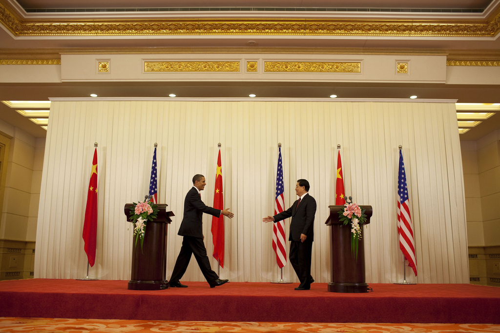
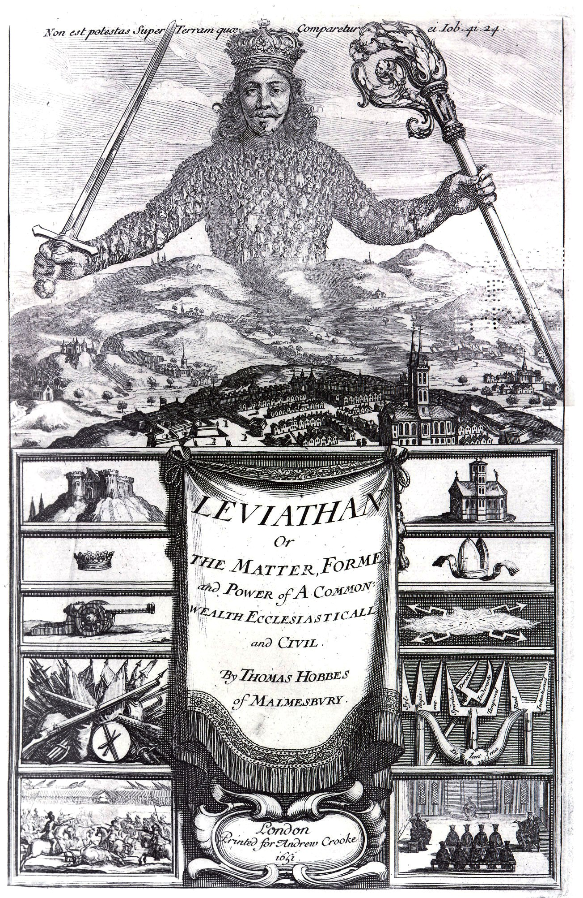

# [fit] Crisis Diplomacy

# Anarchy and Diplomacy

# January 8, 2014

---

# Today's Agenda

1. About me. 
2. Anarchy and international politics.
3. What is diplomacy?

^ Ask questions anytime

^ Feel free to stop me if I say something that doesn't make sense

---

# [fit] Anarchy

# and international politics

---

# World Government?

> ... a state is a human community that (successfully) claims the *monopoly of the legitimate use of physical force* within a given territory.
-- Max Weber, "Politics as a Vocation" (1919)

^ Widely accepted definition of a government (think of failed states)

^ The absence of government, by definition, is *anarchy*.

---

# International Anarchy

* States may always resort to force.

* Contracts among states must be self-enforcing.

* *Talk is cheap.*

^ Because contracts can't be enforced, no one can hold you to your promises (positive or negative).

---

^ Example: recent US-China carbon agreement

^ Announced November 11

^ U.S. to cut 26–28 percent by 2025

^ China to hit peak by 2030, and increase non-fossil fuels to 20 percent of usage

^ <http://www.whitehouse.gov/the-press-office/2014/11/11/fact-sheet-us-china-joint-announcement-climate-change-and-clean-energy-c>

---

# Credibility

A statement I make is *credible* if I wouldn't say it unless I meant it.

^ Most of the course will be about establishing credibility!

^ Easy to establish with government and contracts

^ Difficult to establish under anarchy, but necessary for states to achieve things through means other than force.

---

## How could a carbon-cutting promise be credible?

^ Solicit suggestions

---

# What is

# [fit] Diplomacy?

^ Ask for their answers before I begin

---

# The International System

**States:** The members of the system.

**Interests:** What a state wants.

**Power:** The resources a state has to acquire what it wants.

---

# Force versus Diplomacy

**Force:** Directly taking what you want, usually through military means.

**Diplomacy:** Convincing others to give you what you want.

^ Diplomacy may not be nice or even peaceful

---

# Diplomacy and the International System

Without diplomacy, the lives of states would be nasty, brutish, and short.

^ Segue from this into Bull, since anarchy is his main concern

---

# Bull's Definitions of Diplomacy

1. "The conduct of relations between states and other entities with standing in world politics by official agents and by peaceful means."
2. "Such conduct of relations by professional diplomatists."
3. "Such conduct of relations ... which is, in the everyday sense of the term, 'diplomatic', that is, tactful or subtle."

^ Emphasize *standing*, *official*, *peaceful*, *professional*

^ First definition too limiting: can use violence to convince

^ But useful starting points, and conceptual clarity

---

# Credibility and Diplomacy

In a sense, diplomacy is the art of establishing credibility.

^ States don't give up what they want for nothing

^ Convincing takes carrots and sticks, but must believe the carrot will be given or the stick will be applied

---

# For Next Time

* Read Morgenthau 1985, "Diplomacy" and "The Future of Diplomacy" (download from Blackboard)

---

# Image Sources

* Barack Obama and Hu Jintao: White House, via [Flickr](https://flic.kr/p/7iSKQr)
* *Leviathan* frontispiece: [Wikimedia Commons](http://commons.wikimedia.org/wiki/File:Leviathan_by_Thomas_Hobbes.jpg)
