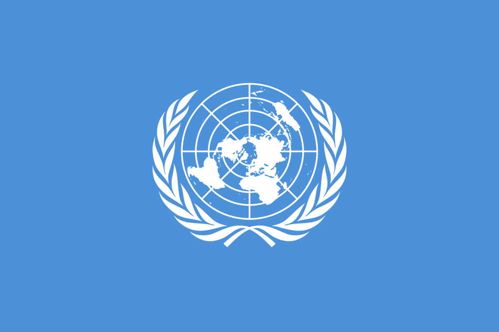
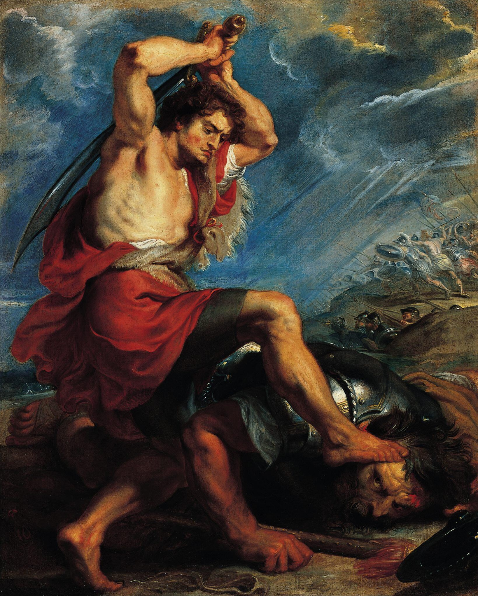

# [fit] Crisis Diplomacy
# Realism, Liberalism, and Diplomacy
# January 15, 2015

---

# Today's Agenda

1. Diplomacy according to Morgenthau.
2. Liberalism: an alternative theory.

---

# [fit] Diplomacy
## according to Morgenthau

---

# Realist Assumptions Redux

1. There is an international system consisting of sovereign states.
2. The international system is anarchical.
3. The main national interest of every state is to preserve its own security and autonomy.
4. In international politics, states always prioritize this national interest.

---

# Tasks of Diplomacy
## (according to Morgenthau)

1. Define the country's own goals.
2. Assess other countries' goals and power.
3. Find common ground between these goals.
4. Choose appropriate means for achieving goals.

^ How does this comport with the realist model?

^ Why will succeeding at these tasks lead to peace?

^ Conversely, why is failing at any one of them a threat to peace?

---

# The Old Diplomacy and the New

Changes in diplomacy after World War I:

* Modern communication technology.
* Reaction against secrecy.
* Parliamentary procedures.
* Rise of the US and USSR.

---

# Vices of the New Diplomacy
## (according to Morgenthau)

1. Publicity.
2. Majority voting.
3. Fragmentation.

---

# Publicity

> "Not only is a publicly conducted diplomacy unable to reach agreement or even to negotiate for the purpose of reaching agreement, but each public meeting leaves international matters in a worse state than before."
> --Morgenthau (p. 579)

^ Why does publicity hurt the participants' bargaining power?

^ Why does it make sense that a realist would prefer secrecy?  (Think of the well-defined national interest.)

---

# Majority Rule

> "[T]he outvoting of an opponent in a deliberative international body is a useless and may even be a mischievous undertaking ..."
> --Morgenthau (p. 579)

^ If majority rule is so bad for international relations, why not for domestic governance too?

---

# Fragmentation

* Consequence of majority voting.
* Sequences of disconnected legislative acts.
* Root problems connecting issues are ignored.

^ Is it that it's impossible to treat root causes in a big forum?  Or just that the big forum is redundant for that?

---

# [fit] Liberalism:
# an alternative theory

---

# Liberal Assumptions

1. Multiple channels connect societies.
2. Issues on the international agenda are not arranged in a hierarchy.
3. On the issues where liberalism[^1] prevails, states do not use military force.

[^1]: aka complex interdependence

^ Contrast with realism

^ Logically coherent?

^ Parsimony versus plausibility?

---

# The Main Liberal Conclusion

Weak states' interests may prevail over those of strong states.

^ Explain how this differs from realism.

^ Follow from the premises?

^ Comport with reality?

---

# Virtues of the New Diplomacy
## (according to Keohane and Nye)

* Formal equality for all states.

* New lines of communication.

* Negotiation through *issue linkage*.

^ For the communication point: both poor states without worldwide diplomatic corps, and subnational actors like state agencies

^ Do these create peace?  (Remember that liberalism *assumes* military options are off the table.)

^ So the assumptions have changed, but the goalposts have moved too

---

# Issue Linkage

Trading concessions on one issue for gains in another, possibly unrelated issue.

Keohane and Nye: issue linkage is the main diplomatic tool for weak states.

^ Why so important—since main tool for weak states, this is what allows divergence between power and outcomes

^ Why is it mainly for weak states?

^ What is it about liberalism that enables linkage to be fruitful?

^ Relationship to Morgenthau's "fragmentation"—isn't it the same thing?  Why does he say IOs are harmful while K&N say helpful?

---

# Realism versus Liberalism?

Is one theory right and the other wrong?

^ Different applications and usefulness

^ Why not to go looking for one true theory

---

# For Next Time

* Read Fearon 1995, "Rationalist Explanations for War"

---

# Image Sources

* UN Flag: [Wikimedia Commons](https://commons.wikimedia.org/wiki/File%3AFlag_of_the_United_Nations.svg)
* Peter Paul Rubens, "David Slaying Goliath": [Wikimedia Commons](http://commons.wikimedia.org/wiki/File%3APeter_Paul_Rubens_David_Slaying_Goliath.jpg)
