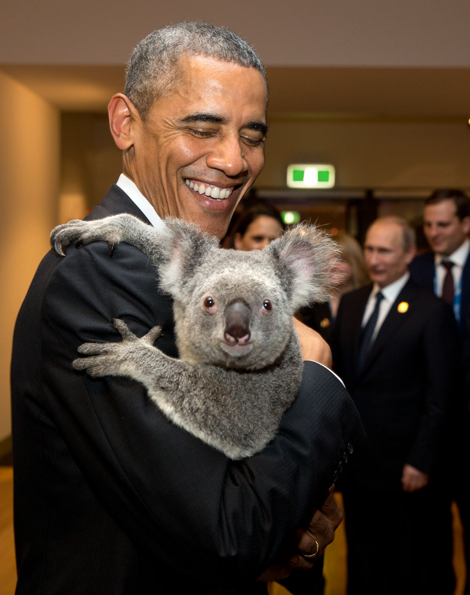

# [fit] Crisis Diplomacy
# Threats of Force
# January 20, 2015

---

# Today's Agenda

1. Bargaining: an overview.
2. Demands and threats.
3. Coercive diplomacy.

---

# [fit] Bargaining:
# an overview

---

# Definition

*Bargaining* is the process of finding mutually acceptable divisions of a valuable good.

^ Mutually acceptable relative to the alternative (which depends on situation)

^ Mutually acceptable doesn't mean fair

---

# Elements of Bargaining

* Two or more actors
* Valuable object at stake
* Settlement outcome
    * Division of the object
    * All must agree
* Disagreement outcome
    * If a settlement isn't reached
    * Each actor gets their *reservation value*

---

# Example: The Ultimatum Game

I propose how to divide a dollar between you and me.

If you accept, we each get our share.

If you reject, we each get nothing.

^ What is the object, the settlement outcome, the disagreement outcome, and reservation values?

^ If I offered you a penny, would you take it?

^ What's the lowest amount you would take?

^ How would it be different if the disagreement outcome were a 50-50 split?

^ What if it were ten thousand dollars, and I offered you a hundred?

---

# Bargaining Power

Your bargaining power depends on how little you have to lose from disagreeing.

Higher reservation value → more bargaining power.

^ Bargaining power depends on if you can credibly threaten to force disagreement

---

# Demands and
# [fit] Threats

---

# Making a Demand

* Settlement outcome: you accept my demand
* Disagreement outcome:
    * Status quo
    * ... or I carry out a threat
* Reservation value: depends on the credibility of the threat

---

# Requirements for a Successful Demand

1. For me: carrying out threat > status quo
    * The threat must be *credible*
2. For you: the demand > the threat

---

# "Give me your wallet or I'll take it myself."

^ Identify the demand, the disagreement outcome, the reservation values

^ Credibility—and thus success—depends on who's talking

^ You'd only accept my demand if you think I could take it anyway

^ Next week: "Give me your wallet or I'll hurt you"

---

# Coercive
# [fit] Diplomacy

---

# Force and Diplomacy
## (a friendly reminder)

**Force:** Directly taking what you want.

**Diplomacy:** Convincing others to give you what you want.

^ What you can get via diplomacy depends, in part, on what you can get via force

---

# Bargaining and Anarchy

Another reminder: *States may always resort to force.*

What does this mean for international bargaining?

^ The natural disagreement outcome is war

^ No negotiated settlement may be worse for a state than what it could get by force

^ Bargaining power is a function of what you would get by force

---

# Demands Backed by Force

1. The challenger must expect at least as much from war as it is demanding.
2. The challenger's cost of war must not be too high.

^ A challenger makes a demand of the target, threatening war if the demand isn't accepted

---

---

Obama, August 2012:

"We have been very clear to the Assad regime but also to other players on the ground that a red line for us is, we start seeing a whole bunch of weapons moving around or being utilized.

“That would change my calculus.  That would change my equation.”

^ Year after Obama called for Assad to resign

^ One year later, Syria is caught using chemical weapons.  Obama seeks congressional approval for air strikes despite claiming authority to act unilaterally.  A week after that, action was tabled after a U.S.-Russian-Syrian agreement for Syria to destroy its chemical weapons.

^ Who had the bargaining power here?

^ Did the U.S. demand work?  Was it credible?  Why or why not?

<!-- http://www.nytimes.com/2012/08/21/world/middleeast/obama-threatens-force-against-syria.html -->

---

# For Next Time

* Finish reading Fearon 1995, "Rationalist Explanations for War"

---

# Image Sources

* Obama with koala: The White House, via [Flickr](https://flic.kr/p/pDhKpw)
* Bashar al-Assad: [Wikimedia Commons](http://commons.wikimedia.org/wiki/File:Bashar_al-Assad.jpg)
