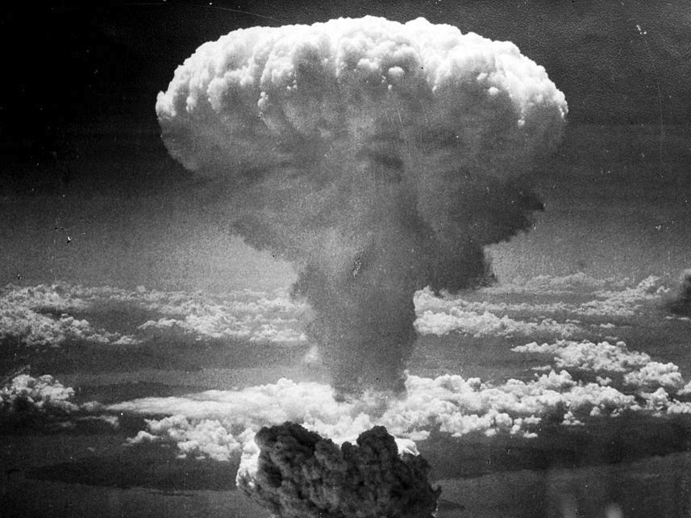
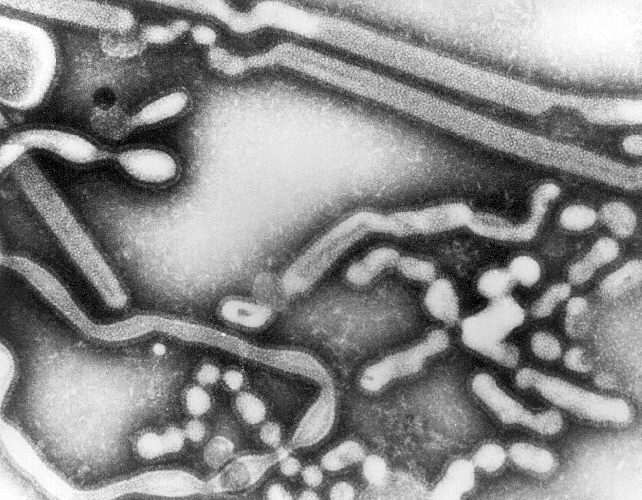
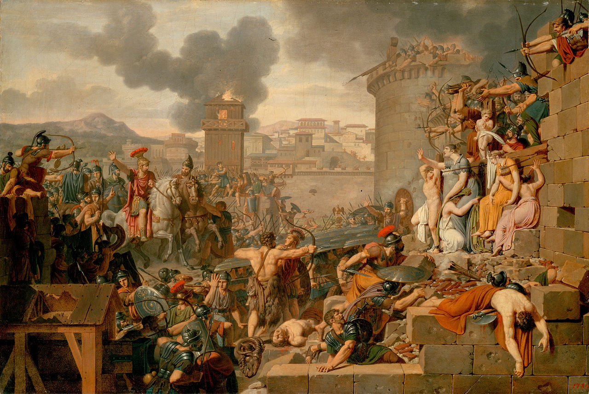
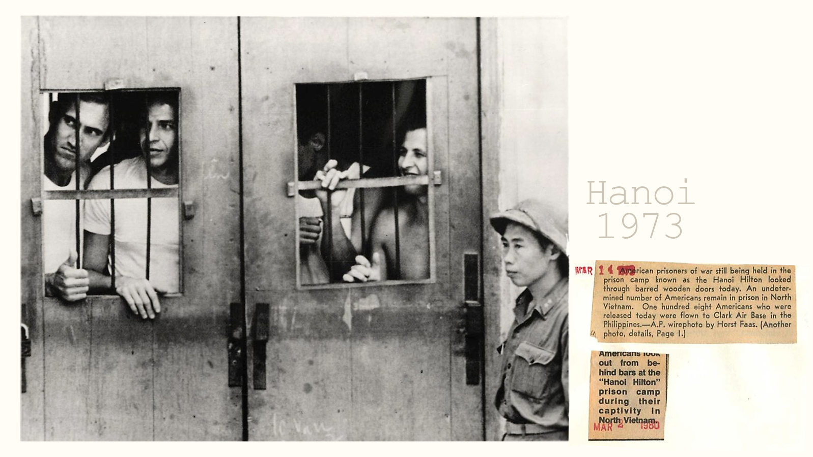
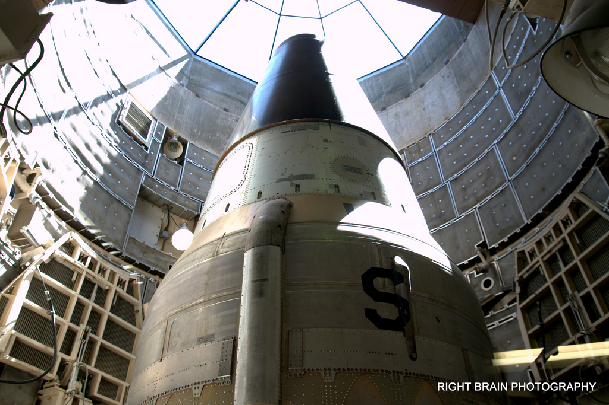

# [fit] Crisis Diplomacy
# The Power to Hurt
# January 27, 2015

---

# Today's Agenda

1. A note on the flu.
2. Bargaining and the power to hurt.
3. Rational deterrence theory.

---

# A Note on the Flu

If you have the flu:

1. **Please stay home.**
2. You don't need to inform me or provide a doctor's note unless there is an exam that day.

---

## Bargaining and the power to
# [fit] Hurt

---

# Review

* Force versus diplomacy
* Demands backed by force

---

# The Power to Hurt

A form of diplomacy whereby you threaten to make another party suffer if they don't yield to your demand.

^ Distinction from demand backed by force?

---

^ Sieges

---

^ Hostages/prisoners of war

---

^ Terrorism

---

^ Nuclear weapons

---

# The Power to Hurt: A User's Guide

1. The threat must be credible.
2. The target must rather give in than suffer the threatened harm.

^ So one way to fight back is to make yourself less "hurtable"

---

# "Give me your wallet or I'll shoot."

^ Compare to "Give me your wallet or I'll take it myself"

---

# Bargaining and the Power to Hurt

How do our findings from last week about bargaining and force change if we introduce the power to hurt?

^ Weaker states can "win" at the bargaining table

^ The bargaining range can shrink or grow

^ "Willingness"/resolve gains outsized importance

---

# Rational
# [fit] Deterrence
# Theory

---

# Historical Backdrop

Conventional force and the power to hurt used to be intertwined.

Nuclear weapons tore them apart.

^ Only way to hurt the opponent enough to extract concessions was in ordinary warfare

^ So we saw strategies designed at hurting, but went in tandem with the process of seizing what you wanted

^ With nuclear weapons, can inflict pain without making any progress toward direct seizure

---

# The Policy Question

How can the United States remain safe from the Soviet Union?

^ Invest in conventional forces or nuclear weapons?

^ Most advanced nuclear technology, greatest quantity, or both?

^ What about nonproliferation?

---

# Schelling's Answer

The U.S. must maintain the *credibility* of its nuclear threat to deter the Soviet Union from acquiring more territory.

^ Easy to deter invasion on U.S. soil, not so much Western Europe (nuclear umbrella)

^ This seems dangerous, but Schelling says not

^ If the U.S. is firm enough, the Soviets won't challenge, and then the nuclear threat need not be invoked!

---

# Rational Deterrence Theory
## Premises

1. All else equal, states want to acquire more territory and influence.
2. States would rather have less territory and influence than be nuked.
3. It is common knowledge that states have these preferences.

^ Logically coherent?

^ Parismony and plausibility?

---

# Rationality

To be *rational* is to have well-ordered preferences.

Rationality does not imply:

* Selfishness
* Common sense
* Being a human calculator
* Perfect perception or foresight

^ Well-ordered: no cycles

^ This is why we call it rational deterrence theory

---

# Common Knowledge

Something is *common knowledge* if

* I know it
* You know it
* I know you know it
* You know I know it
* I know you know I know it
* ...

---

# Rational Deterrence Theory
## Conclusions

To prevent another state from acquiring more territory and influence without using force against it, establish a credible nuclear threat.

^ Does it follow from the conclusions?

^ Does it fit reality?  (Segue into next point.)

---

# Theory and Policy

The conclusion of rational deterrence theory is a policy recommendation—not an ordinary fact.

^ So how do we test it?  What are the dangers here?

---

# For Next Time

* Read Schelling, ch. 3: "The Manipulation of Risk"
* Keep reading *Essence of Decision*

---

# Image Sources

* Mushroom cloud over Nagasaki: [Wikimedia Commons](https://wikimediafoundation.org/wiki/File:Nagasakibomb.jpg)
* Armand-Charles Caraffe, "Metellus Raising the Siege": [Wikimedia Commons](http://commons.wikimedia.org/wiki/File:Caraffe,_Armand-Charles_-_Metellus_Raising_the_Siege.jpg)
* Twin Towers: Michael Foran, via [Flickr](https://flic.kr/p/n9hh7)
* Prisoners of war: "`manhhai`", via [Flickr](https://flic.kr/p/dCfq5h)
* Nuclear warhead: Right Brain Photography, via [Flickr](https://flic.kr/p/6iFydR)
