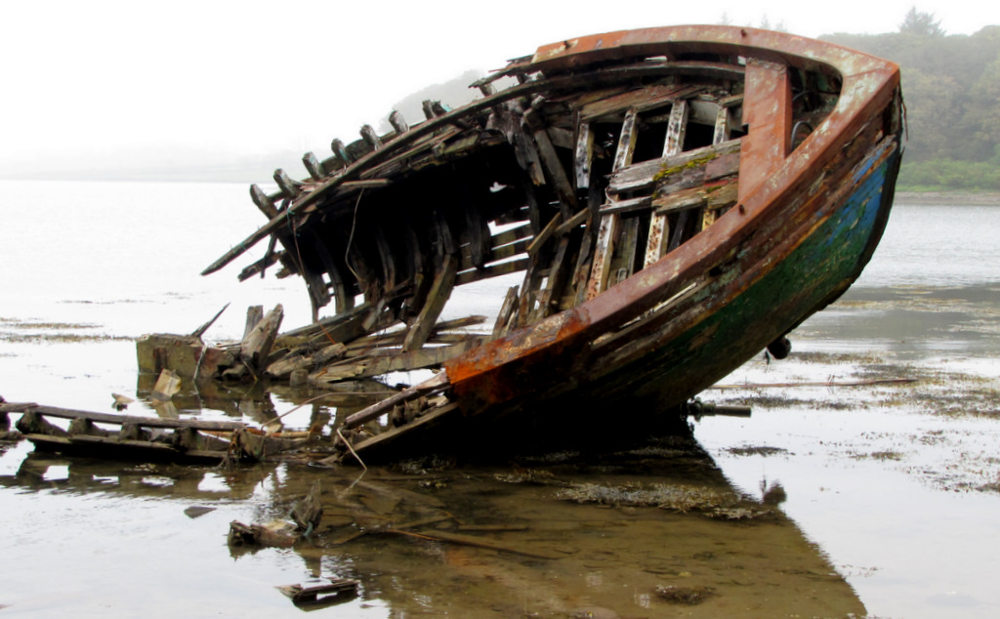

# [fit] Crisis Diplomacy
# Credible Commitments and Brinkmanship
# January 29, 2015

---

# Today's Agenda

1. Credibility: a cookbook.
2. Resolve and brinkmanship.

---

# [fit] Credibility:
# a cookbook

---

# The Power to Hurt
## (a quick review)

Threatening to make another party suffer if they don't yield to your demand.

The threat won't be successful unless it is *credible*—you would rather carry it out than live with the status quo.

^ Problem with nuclear threats: nuclear war harms us all!

---

# How to Establish Credibility

* Appearing "irrational"
* Trip wires
* Publicity

---

# Appearing "Irrational"[^1]

If a threat would be crazy to carry out, let the enemy think you're just crazy enough.

[^1]: Or, more accurately, "Having preferences that defy common sense."

---

[Copyrighted image of The Joker removed for online distribution.](http://tinyurl.com/msrdmdp)

^ Do any examples from international relations come to mind?

^ How to show you're "really" crazy, not just strategically crazy?

---

# But Don't Appear *Too* Crazy

The enemy must think you're willing to carry out the crazy threat.

But what if you look so eager that you'd do it no matter what?

^ Ideal preferences: Get your way > Threat > SQ

---

# Trip Wires

Take the decision to follow through on the threat out of your hands.

^ In theory lets you make truly insane threats!

---

[Copyrighted image of Dr. Strangelove removed for online distribution.](http://virginiafilmfestival.org/wp-content/uploads/2014/09/DrStrangeloveFINAL.jpg)

---

# Problems with Trip Wires

* Technology
* No trapdoors allowed
* Incentives to misrepresent
* Common knowledge and riskiness

^ Technology is why we use political trip wires in reality

^ Connection between incentives to misrepresent and riskiness

---

# Publicity

Another way to commit is to just say you're committed.

* Domestic audience
* International audience

---

# Reputation

Schelling claims that commitments are *interdependent*: our past behavior affects whether our threats are credible now.

^ Carrying out an expensive threat may be worth it if our reputation is at stake

^ If other states know this, won't we not have to carry out the threat?  But then wouldn't all threats be credible?

^ Conclusion: sometimes, but not all the time, we'll see "too costly" threats carried out

^ How can a state with a poor reputation fix it?

^ Why do we need to make the claim out loud in order for our reputation to depend on it?  (Don't other countries know what our interests are?)

---

# Resolve and
# [fit] Brinkmanship

---

# Bargaining Power
## (a quick review)

The less you have to lose from disagreement, the more bargaining power you have.

What if I have less to lose—but it's still a lot?

---

# Bargaining in the Shadow of Disaster

We must figure out how to divide $20.

You get to make a proposal to me.

If I accept, we get what we agreed on.

If I reject, I have to pay $100 and you have to pay $1000.

^ I should have the bargaining power here, by our definition

^ But in reality you'll end up with the $20 (or the vast majority of it)

---

# Risking Disaster

Let's change what happens when I reject the offer.

There's a 10% chance I have to pay $100 and you have to pay $1000.

There's a 90% chance we try again, but now I get to make the offer.

^ If you offer me nothing, will I reject it?

^ And now if I offer you nothing, will you reject it?

^ So will you offer me nothing in the first place?

^ Can't credibly threaten disaster, but can credibly threaten to *risk* it—and the less you have to lose, the more risk you can take

---

# Brinkmanship

Convincing others to give you what you want by running the risk of mutually harmful outcomes.

^ Schelling argues in favor of its use

^ For it to work, you have to actually be the more resolved one!

---

# Deterrence and Compellence

**Deterrence:** Stopping someone else from doing something you don't want.

**Compellence:** Convincing them to do something you do want.

Which purpose does brinkmanship serve better?

^ Motivate in terms of status quo in the bargaining model

---

# Two Questions about Brinkmanship

1. Is nuclear brinkmanship really possible?
2. If so, is *Arms and Influence* really a guide to keeping us safe from global nuclear war?

^ 1. What kinds of actions raise the risk of a nuclear war that we can't stop?  Can't someone always step in and stop it?

---

# For Next Time

* Read Jervis 1976, "Deterrence, the Spiral Model, and Intentions of the Adversary" (on Blackboard)
* Keep reading *Essence of Decision*

---

# Image Sources

* Shipwreck: Barbara Walsh, via [Flickr](https://flic.kr/p/a7ypWs)
