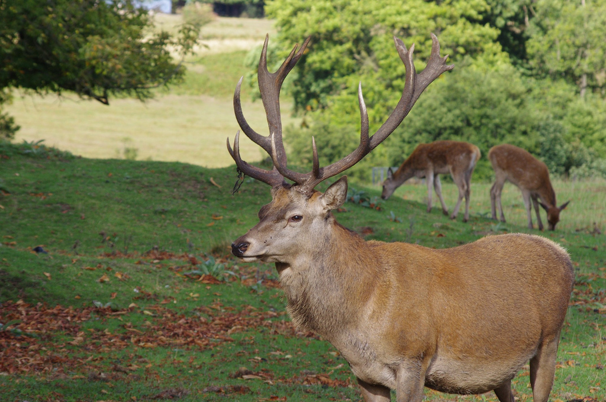

# [fit] Crisis Diplomacy
# Models of Mistrust
# February 5, 2014

---

# Recap: Scientific Theories

A theory is a logically coherent set of statements that explain some fact (or facts).

---

# Modeling International Politics

International relations theorists use mathematical models to:

* Make assumptions transparent
* Ensure logical coherence
* Allow for cumulative theory-building
* Deal with complex strategic scenarios

---

# Game Theory

A set of tools to model strategic decision-making.

* Players
* Individual actions → Joint outcomes
* Payoffs (a.k.a. utilities)

---

# Example: The Prisoners' Dilemma

---

# Solving a Game

A set of actions is an *equilibrium* if, given what everyone else is doing, no player would prefer to change their own action.

^ Looks at individual deviations, not joint ones

^ There might be none, or there might be more than one

---

# The Prisoners' Dilemma

^ Why isn't everyone staying quiet an equilibrium?

---

# Brief Aside
## A Real-Life Prisoners' Dilemma

Listen to the Radiolab episode "The Golden Rule":

<http://www.radiolab.org/story/golden-rule/>

---

# The Prisoners' Dilemma and International Conflict

* Alice and Jack ↔ Countries
* Keep Quiet ↔ Disarm (cooperation)
* Snitch ↔ Build arms (defection)

^ What are the limitations of the prisoners' dilemma as a model of international politics?

---

# The Prisoners' Dilemma: A Crucial Assumption

Even if I'm sure you'll cooperate, I prefer to defect.

Is this necessarily true in international politics?

^ Connect to status quo vs revisionist

^ Trust/mistrust

---

# An Alternative Model: The Stag Hunt

^ Note multiple equilibria

---

# The Possibility of Cooperation

* Prisoners' Dilemma
    * You cooperate → I prefer defect
    * You defect → I prefer defect
* Stag Hunt
    * You cooperate → I prefer cooperate
    * You defect → I prefer defect

^ What matters in the Stag Hunt is how much I trust you (probability you cooperate)

---

# Cooperation and the Stag Hunt

What happens if...

* Both players are starving?
* Both like rabbit almost as much as stag?
* Just one is starving?
* Just one likes rabbit almost as much as stag?

---

# Spirals and the Stag Hunt

In order to trust you, I can't give you a reason not to trust me.

^ Connect to security dilemma (taking steps to prepare myself if you don't cooperate can be counterproductive if you intend to cooperate)

^ Contrast with PD

---

# Offense, Defense, and the Security Dilemma

* Offense-defense balance
    * Stag Hunt instead of Prisoners' Dilemma
    * Less "hungry" in the Stag Hunt
* Offense-defense differentiation
    * Less uncertainty in the Stag Hunt

---

# Discussion Question

What important features of international politics do both of these models leave out?

---

# For Next Time

* Finish reading *Essence of Decision*
* First short paper to be assigned

---

# Image Sources

* Stag: David Merrett, via [Flickr](https://flic.kr/p/aGXkFr)
