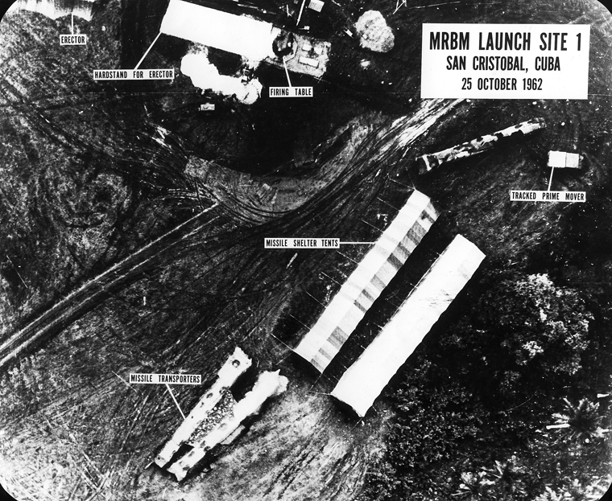

# [fit] Crisis Diplomacy
# The Cuban Missile Crisis
# February 10, 2015

---

# Today's Agenda

1. Roadmap.
2. The Cuban Missile Crisis in perspective.
3. Short paper expectations.

---

# Where We've Been

* What is diplomacy?
* Diplomacy in international relations theory
* Bargaining and threats to use force
* Deterrence and the power to hurt
* Spiral models and the security dilemma

---

# Where We're Going

* Testing deterrence theory
* Alliances
* Domestic politics
* Peace

---

# The
# [fit] Cuban Missile Crisis
# in perspective

^ Going to see how what we've talked about enhances our reading of the CMC, and vice versa

---

# What Is Diplomacy?

Which aspects of the crisis were *diplomacy*, and which were *force*?

---

# What Is Diplomacy?

* Diplomacy
    * U.S.–Soviet exchanges
    * Placement of the missiles in Cuba
    * Blockade?
* Force
    * Blockade?

---

# Diplomacy in International Relations Theory

How did secrecy and publicity shape how the crisis played out?

---

# Diplomacy in International Relations Theory

* Secrecy
    * Soviet movement of missiles
    * Assurances about Jupiter missiles in Turkey
* Publicity
    * Kennedy statements prior to and during crisis

---

# Bargaining and Threats to Use Force

Were there any demands backed by a threat of force?

^ Implicit threat of force in U.S. ultimatum? (air power to take out missiles)

---

# Rational Deterrence Theory

Which threats were *credible*, and which weren't?

Did either side engage in *brinkmanship*?

---

# Rational Deterrence Theory

* Credibility
    * U.S. deterrence failure?
    * U.S. compellence success?
    * Soviet deterrence success?
    * Soviet compellence failure?
* Brinkmanship
    * Placement of missiles
    * Blockade

^
US deterrence = no Cuba as offensive base
US compellence = missiles out of Cuba
Soviet deterrence = US out of Cuba
Soviet compellence = West out of Berlin

^ For each: ask why credible (or why failed even if credible)

---

# The Spiral Model

Were the outcomes of threats consistent with deterrence theory?

Or did they set off a security dilemma?

---

# The Spiral Model

> "If Cuba was 'lost,' Khrushchev remarked, 'I knew it would have been a terrible blow to Marxism-Leninism.  It would gravely diminish our stature throughout the world, but especially in Latin America" (p. 84).

---

# The Spiral Model

> "'It seems to me my press statement was so *clear* about how we *wouldn't* do anything under these conditions, and under the conditions that we *would*.  He must know that we're going to find out.  So it seems to me he just ...' and then Kennedy's voice trailed off" (p. 81).

^ Previous speech where he said no U.S. invasion unless Cuba threatens other Latin American countries or becomes offensive base for U.S.S.R.

---

# Short Paper Expectations

* Make an argument and make it clearly
* Back up the argument
* Consider alternatives
* Be academically honest

---

# For Next Time

* Finish reading *Essence of Decision*

---

# Image Sources

* MRBM site: [Wikimedia Commons](http://commons.wikimedia.org/wiki/File:MRBM_Launch_Site_1,_25_October_1962.jpg)
