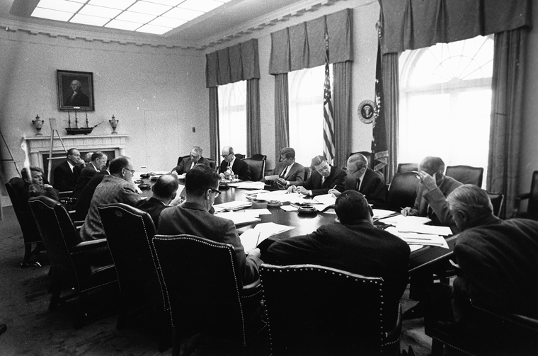

# [fit] Crisis Diplomacy
# Alternative Models of International Crises
# February 12, 2015

---

# Theories and History

Two ways to integrate them:

1. Historical evidence as empirical test of a theory.
2. Theory as framework to interpret case evidence.

---

# History as Theory Testing

* Procedure
    1. Derive hypotheses from premises
    2. Compare to historical record
* Best with
    * multiple theories
    * multiple cases
* Example: Next week's readings

^ No theory will fit *every* case, or every aspect of every case

---

# Theory as Historical Interpretation

* Procedure
    1. Collect historical evidence
    2. Organize in line with theoretical framework
* Best with
    * one or more theories
    * one or more cases
    * (but not multiple of both)
* Example: *Essence of Decision*

^ Multiple theories: gives diverse views of same evidence, reveals non-obvious things

^ Multiple cases: shows how the theory can give unified explanation of disparate evidence, also might highlight blind spots in the theory

---

# Allison's "Models"

* Not theories per se
* Guidelines for theory-building
    * Families of explanations
    * What to hold fixed
    * What to focus on

^ Many rationalist theories, but all belong to a family of sorts

---

# Comparing Models

There's no "right" model of the Cuban Missile Crisis, let alone all crises.

Which model is best depends on which aspects you want to explain.

---

# Rational Actor Model

* Holds fixed
    * State interests and preferences
    * Actions available to a state
* Used to analyze
    * Strategic choices
    * Outcomes of international *interactions*

---

# Limitations of the Rational Actor Model

Where do state interests and preferences come from?

Where do constraints on state action come from?

Why do states act in ways that rationalist theories can't account for?

^ Third question is the least relevant—there isn't much rationalists can't account for (maybe cycles, inconsistent behavior, failing to collect information)

---

# Organizational Behavior Model

* Holds fixed
    * State interests and preferences
    * Other states' behavior
* Used to analyze
    * Actions available to a state
    * How state actions are executed

---

# Organizational Behavior Model
## Constraints on State Action

* Logistical difficulties
* Imperfect lines of communication
* Necessity of delegation

How did these affect the Cuban Missile Crisis?

^ Logistics: Large-scale action requires large-scale coordination

^ Communication: Some decisions need to be made on the fly (hence contingency plans, SOPs)

^ Delegation: Only so many hours in the day

---

# Organizational Behavior Model
## What States Can't Do

Why didn't Kennedy choose air strikes?

* Standard operating procedures
* Physical capacity of the military

^ SOPs → need to destroy air defenses first (why couldn't Kennedy overrule the military on this?)

---

# Organizational Behavior Model
## Things the Rational Model Can't Explain

Why would nuclear-armed F-102s be flying near Soviet airspace in the midst of a major crisis?

* Standard operating procedures
* Imperfect communication

^ Also think from perspective of Soviets at the time—rational model would have been dangerous

---

# Integrating Rationalist and Organizational Models

Brinkmanship can't work unless there's a chance of an accident.

The organizational behavior model shows how an accident can happen.

^ Remind why we were skeptical before

^ But: Did the U-2/F-102 incident actually help the US?

---

# Governmental Politics Model

* Holds fixed
    * Actions available to a state
    * Other states' behavior
* Used to analyze
    * State interests and preferences
    * Why seemingly suboptimal actions are chosen

^ Emphasize *bargaining* among branches

---

# Governmental Politics Model
## Choosing the Blockade

Why did Kennedy choose a blockade paired with an ultimatum?

---

# Governmental Politics Model
## Choosing the Blockade: Options and Initial Opinions

**Negotiations:** Rusk (State)

**Blockade (+ Ultimatum):** McNamara (DOD), Dillon (Treasury)

**Air Strike:** Acheson (former State), McCone (CIA), Bundy (WH), R. Kennedy (DOJ)

**Air Strike + Invasion:** Taylor (JCS)

^ Are there systematic patterns of support?

^ Does the fact that the blockade was chosen reflect the balance of power among these principals?

^ Is there evidence of horse trading or side payments among parties?

^ Alternative explanation: This wasn't bargaining, but deliberation—just a political-looking means by which a unitary actor reached the optimal decision

^ No evidence it was anything but Kennedy's decision; he was just weighing options

---

# Governmental Politics Model

It's not enough to show there was disagreement.

Need evidence of

* "Where you stand depends on where you sit"
* Bargaining (≠ disagreement)
* Relative agency power influencing final decision

---

# Integrating Governmental and Rationalist Models

"Two Level Games" ... which we'll see later.

---

# For Next Time

* Turn in first short paper
* Read Huth and Russett, "What Makes Deterrence Work?" (JSTOR)

---

# Image Sources

* EXCOMM meeting: [Wikimedia Commons](http://en.wikipedia.org/wiki/File:EXCOMM_meeting,_Cuban_Missile_Crisis,_29_October_1962.jpg)
