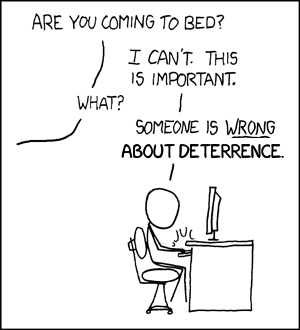

# [fit] Crisis Diplomacy
## Testing Deterrence Theory
## February 26, 2015

---

# Last Time

We had a crash course in empirical analysis.

1. State hypotheses
2. Collect data
3. Make inferences

---

# Today's Agenda

How can we test hypotheses derived from rational deterrence theory?

* Huth and Russett's approach
* Lebow and Stein's objections
* Resolving debates like these

---

# Deterrence — Definitions

* Target being defended
    * Direct: self
    * Extended: third-party "protegé"
* Time frame
    * General: all time
    * Immediate: imminent danger

---

# Unit of Analysis

Extended immediate deterrence attempts:

* Attacker considers using force against protegé
* Defender recognizes the potential attack
* Defender makes threats—explicit or implicit—in protegé's defense

Sample: All such attempts, 1900–1980.

^ Why focus on these? Most common (and easy to observe) cases of deterrence in action, and relevant to main concerns of RDT (US in Western Europe)

^ Sample needs to extend to before 1945 in order for nuclear weapons to be a variable (or variable enough)

---

# Dependent Variables

1. Deterrence success
    * Did the attacker back down?
    * Observed for all deterrence attempts
2. Defender follow-through
    * Did the defender keep its promise?
    * Observed only when deterrence fails

---

# Operationalizing the Dependent Variables

* Deterrence failure
    * Armed engagement, 250+ battle deaths
    * OR attacker gets what it wants
    * OR attacker occupies protegé's territory
* Defender follow-through
    * Defender forces participated in fighting

^ Evaluate these, particularly "met its goals" (think in terms of bargaining model)

^ Think about spiral model—would we end up coding conflict spirals as "deterrence failure"?

---

# Independent Variables

* Balance of military capabilities
* Defender has nuclear weapons
* Defender's past behavior
* Defender–protegé relationship
    * Pre-existing alliance
    * Economic ties
    * Capability balance
    * Contiguity

^ How would RDT predict each of these affects deterrence success?  What about spiral model?

^ Capability balance—connect to demands backed by force (and note that Huth and Russett don't distinguish those from threats to use the power to hurt)

^ What important factors are missing?  How could they be operationalized?

---

# Results
## Deterrence Success

✔ Trade ↑ Success
✔ Power Preponderance ↑ Success
✘ Alliance Ties ↓ Success
✘ Nuclear Arms ↮ Success
✘ Past Behavior ↮ Success

^ How should we interpret the failures? Talk about usefulness of power to hurt, bring back to RDT vs. spiral model

^ Remember that possessing nuclear arms is only *part* of nuclear credibility (and the other parts are hard to measure)

---

# Results
## Defender Follow-Through

* Protegé's Power ↑ Follow-Through
* Alliance ↑ Follow-Through
* Past Behavior ↮ Follow-Through

^ If alliance ↑ follow-through, why alliance ↓ deterrence success?

---

# Objections to Huth and Russett
## (by Lebow and Stein)

L&S challenge all of H&R's key operationalizations:

* Extended immediate deterrence attempts
* Deterrence failure
* Deterrence success

---

# Operationalization Controversies
## Extended Immediate Deterrence Attempts

**H&R:** overt threat and counterthreat

**L&S:** evidence of *intention* to attack/defend

^ For each of these, ask what RDT would say, and thus which set of authors was more on point

^ Selection bias — per H&R, it's only possible to infer intention/seriousness for certain in cases of failure

---

# Operationalization Controversies
## Deterrence Failure

* **H&R:**
    * armed engagement, 250 battle deaths
    * attacker gets what it wants
    * attacker occupies protegé
* **L&S:**
    * challenger does what defender tried to deter
    * defender backs down from commitment

^ In practice, not much difference

^ Example of CMC: would have been a success by H&R's criteria (per L&S)

---

# Operationalization Controversies
## Deterrence Success

**H&R:** absence of failure

**L&S:** absence of failure directly traceable to threat

^ Back to intentions

^ Example to support H&R: what if the attacker was nearly indifferent (costs of fighting just barely less than benefits) and then a marginally credible threat was made to tip the balance?  Then deterrence succeeded (was necessary condition for no attack) but wasn't *primary* reason

---

# Resolving Operationalization Debates

1. Agree about assumptions
2. Stay close to those assumptions in data collection
3. Perform robustness checks

^ Don't have to agree which assumptions are *best*, but need to know which ones we're working from

^ Disagreement about assumptions is a theory debate, not an operationalization debate

^ Stay close = Coding decisions should closely reflect theoretical implications

---

# For Next Time

* Spring Break!
* Read Walt, "Explaining Alliance Formation" (Blackboard)

---

# Image Sources

* "Duty Calls": Randall Munroe, [XKCD #386](http://xkcd.com/386/)
