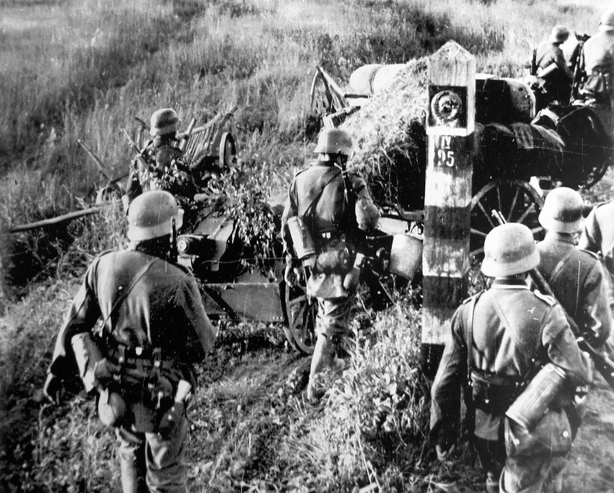

# [fit] Crisis Diplomacy
# Keeping Alliance Commitments
# March 12, 2015

---

# Recap: Questions about Alliances

1. Who will states seek out as allies?
2. Why make formal alliance commitments?

---

# The Puzzle of Formal Alliances

A formal alliance pact is neither *necessary* nor *sufficient* for one state to give military aid to another.

---

# Roles of Formal Alliances

1. Commitment
   * Ensure allies come through in case of war
2. Signaling
   * Demonstrate commitment to the world
   * Deter potential attacks

---

# A Basic Model of Alliances
## The Players

* Three states: $$A$$, $$B$$, and $$C$$
    * $$A$$ and $$B$$ at war
    * $$C$$ potential ally of $$A$$
* $$C$$'s choices:
    * Stay out
    * Fight alongside $$A$$

Under what conditions will $$C$$ decide to fight?

---

# A Basic Model of Alliances
## Spoils of War

* Value of winning war: $$v > 0$$
* $$C$$'s share of the spoils
    * $$A$$ loses: $$0$$
    * $$C$$ stays out and $$A$$ wins: $$s_{out} \times v$$
    * $$C$$ fights and $$A$$ wins: $$s_{fight} \times v$$

^ Motivation for v: value of piece of territory at stake

---

# A Basic Model of Alliances
## War Outcomes

* Probability $$A$$ wins
    * $$C$$ stays out: $$p_{out}$$
    * $$C$$ fights: $$p_{fight} > p_{out}$$
* What $$C$$ expects to get
    * Stays out: $$p_{out} \times s_{out} \times v$$
    * Fights: $$p_{fight} \times s_{fight} \times v$$

---

# A Basic Model of Alliances
## Costs

* Cost $$C$$ pays
    * Stays out: $$k_{out}$$
    * Fights: $$k_{fight}$$

^ Which would we generally expect to be greater?

---

# A Basic Model of Alliances
## The Choice to Fight

State $$C$$ chooses to fight if:

$$
\begin{align}
&(p_{fight} \times s_{fight} \times v) - k_{fight} \\
&\qquad \gt (p_{out} \times s_{out} \times v) - k_{out}
\end{align}
$$

---

# How Can Formal Pacts Increase Commitment?

* Raise chance of joint victory: $$p_{fight}$$
* Raise ally's share of the spoils: $$s_{fight}$$
* Reduce ally's cost of fighting: $$k_{fight}$$
* Raise ally's cost of staying out: $$k_{out}$$

^ For each, ask how formalization can accomplish the goal

---

# Signaling and Deterrence

For $$C$$ to successfully deter $$B$$ by threatening to ally with $$A$$:

1. $$B$$ must believe the threat
2. $$B$$ must rather stay home than fight a coalition of $$A$$ and $$C$$

---

# How Can Formal Pacts Deter Aggression?

* Raise perceptions of commitment
    * Show allies have shared interests
    * Raise actual degree of commitment
* Raise chance of joint victory

---

# Measuring Commitment Success

Leeds et al. ask:

*Do* states usually follow through on formal alliance commitments?

---

# Data Collection

* Unit of analysis: an alliance that is tested
    * War occurs
    * Participant is a member of an alliance
* Variable of interest: alliance reliability
    * Which sides did the other partners take?
* Time period: 1815–1944

---

# Operationalizing Alliance Reliability
## An Easy Way

1. Find countries with formal military partnerships with country at war
2. Code based on which side they took:
    * Partner's side → Success
    * Other side → Failure
    * Stayed out → Abstention

---

# Easy Way Results

^ Any operationalization involves simplifications, so shouldn't dismiss these out of hand without a better alternative

---

# Operationalizing Alliance Reliability
## A Harder—But Better—Way

1. Find countries with formal military partnerships with country at war
2. Actually read the terms of the partnership
3. Code based on whether the terms were upheld
    * Upheld → Success
    * Violated → Failure
    * Did not apply → N/A

^ e.g., if it was a neutrality pact, then neutrality is a success

---

# Leeds et al.: Main Results

---

# Should States Bluff More?

Even if both sides only intend to stay neutral, why not call it a defense pact?

---

# Limitations

* Selection bias: the more credible the commitment, the less likely to be tested
* No explanation of *variation* in commitment success

---

# For Next Time

* Read Putnam, "Diplomacy and Domestic Politics" (JSTOR)
* Second short paper prompts to be handed out

---

# Image Sources

* German troops crossing the Soviet border in Operation Barbarossa: [Wikimedia Commons](http://commons.wikimedia.org/wiki/File:German_troops_crossing_the_Soviet_border.jpg)
* Alliance reliability results: Leeds et al. (2000)
