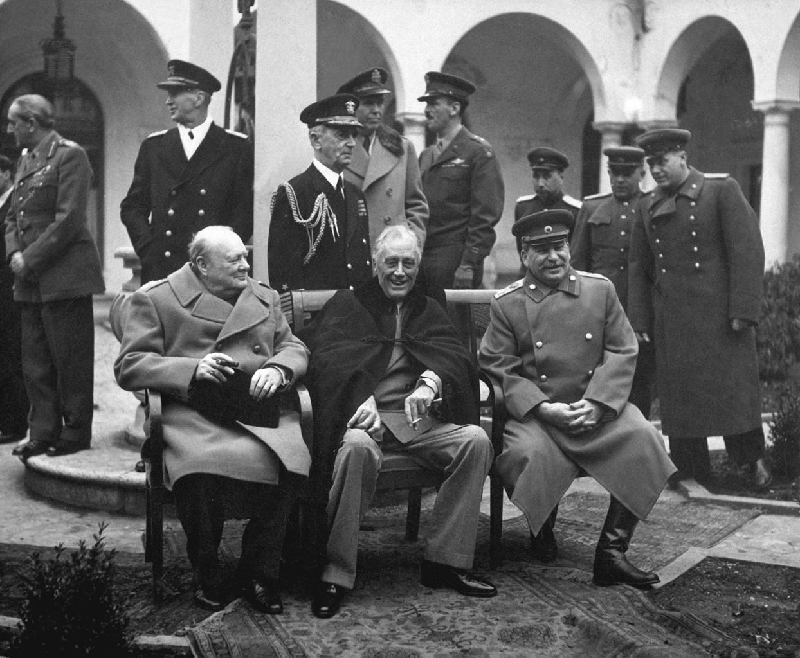

# [fit] Crisis Diplomacy
# Democracy and Commitment
# March 19, 2015

---

# Last Time

Putnam: How do domestic political constraints affect international negotiations?

1. More constraints → More favorable settlements
2. More constraints → Less likely to agree

^ Transition: Today talking about what states do once it's time to follow through on an agreement (or cooperate more generally)

---

# Agreements and Anarchy

* Treaties vs. contracts
* Necessity of self-enforcement
* Possible incentives to defect

^ Treaties can set an expectation that we're all playing along ... which may provide incentives to defect

^ Examples: nonproliferation, free trade

---

# Leeds' Question

How does a state's regime type affect the credibility of its promises to cooperate?

^ Credibility rears its ugly head again

^ Again: using regime type to explain variation

---

# The Argument

* Can't just say one type better than other
* Mutual expectations matter
* Three possible pairings:
   1. democracy-democracy
   2. autocracy-autocracy
   3. democracy-autocracy

^ Why not just dem vs auto?  We know a state's own ability to cooperate depends on its expectations about its partner, so must be dyadic

---

# Leeds' Model

---

# [fit] It's a Stag Hunt.

<!-- Copyrighted image of Admiral Ackbar removed for online distribution. -->

---

# Recap: The Stag Hunt

^ Emphasize mutual expectations

---

# Cooperation in the Stag Hunt

How to increase chance we hunt stag:

* Make rabbit less tasty
* Make hunger less terrifying

---

# Translating the Stag Hunt

* "Make rabbit less tasty"
    * Raise cost of breaking promises
    * Lower temptation to defect
* "Make hunger less terrifying"
    * Lower cost to victim of unilateral defection
    * Raise ability to adjust

---

# Flexibility and Accountability

* Flexibility
    * Easier to adjust to adversity
    * Autocratic advantage
* Accountability
    * Higher costs of defection
    * Democratic advantage

---

# Regime Type and Commitments

* Democracies
    * High accountability → Credible promises
    * Low flexibility → Risk-averse
* Autocracies
    * Low accountability → Credibility problem
    * High flexibility → Risk-acceptant

^ Risk aversion: will only commit if certain it'll work out

---

# Possibility of Cooperation

* Democracy-democracy: likely
* Autocracy-autocracy: likely
* Democracy-autocracy: unlikely

^ Dem-dem: will trust each other because both accountable

^ Aut-aut: don't *need* to trust each other

^ Dem-aut: spiral of mistrust

---

# Taking It to Data

**Hypothesis:** Cooperation is more likely between states with similar regime type.

**Unit of analysis:** Pair of states ("dyad")

**Independent variable:** Shared regime type

**Dependent variable:** Cooperation

---

# Operationalizing Cooperation

* International interactions
    * Newspaper accounts
    * Coded as "cooperative" or not
    * Weighted by intensity
* Cooperation = % coded cooperative in given year

^ Problems with the measure?

^ Not necessarily just agreements/commitments

^ Would simply signing a treaty or reaching an agreement be coded as cooperative?

^ Misses things that happen normally (newspapers don't report "states holding up trade deal")

---

# Controls

What else might be related to both regime type and cooperative success?

* State wealth
* Political stability
* Military alliance

---

# Results

---

# Conclusions

Can't say democracies or autocracies are more reliable overall.

What matters is the *pairing* of regime types.

^ Broader implications for study of crisis diplomacy?

^ Limitations of the analysis?

^ Difference from Putnam and Schelling about advantage of constraints?  Or no?

---

# For Next Time

* Second short paper due
* Read Fearon, "Domestic Political Audiences and the Escalation of International Disputes" (JSTOR)

---

# Image Sources

* Yalta Conference: [Wikimedia Commons](http://commons.wikimedia.org/wiki/File:Yalta_Conference_(Churchill,_Roosevelt,_Stalin\)_(B%26W\).jpg)
* Game tree: Leeds (1999)
