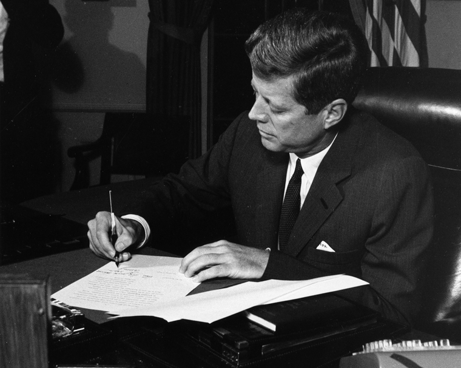

# [fit] Crisis Diplomacy
# Skepticism about Audience Costs
# March 26, 2015

---

# Recap: Audience Cost Theory

* Audience cost = penalty for backing down from threat
* Key assumptions
    * Increase over time in crisis
    * Higher for democracies
* Conclusions
    * Democratic peace
    * Democratic advantage vs. autocracies

---

# Two Faces of Audience Cost Theory

1. Characterization of strategically optimal behavior for states in crises
2. Explanation of actual patterns in real-world crises

^ 1: A demonstration of why it's best to tie your hands in a crisis, and how regimes that can tie their hands more quickly have an advantage

---

# Why Be Skeptical?

Audience cost explanations seem ... weird.

Does the public *really* get mad when leaders are caught bluffing?

Does public clamor *really* push leaders into wars they don't want?

---

# Snyder and Borghard: Summary

Prongs of their argument against audience cost theory:

1. Dependence on questionable assumptions
2. Lack of empirical support

---

# The Importance of Assumptions

Does reliance on questionable assumptions matter?

It depends on the *purpose* the theory is used for.

^ Link back to the parsimony/plausibility discussion

^ Not important for characterization of strategically rational behavior, but definitely important for empirical prediction

---

# Questionable Assumptions
## (per Snyder and Borghard)

1. Leaders try to tie their hands
2. Publics care about word-deed consistency
3. Audience costs are large
4. Targets of threats understand audience costs

^ 1: Distinguish from flexibility

^ 2: Distinguish from policy preferences

^ 3: Must be true if a primary explanation of international outcomes

---

# Questionable Assumptions

*(1) "Leaders seek lock-in, not flexibility."*

* Actually a conclusion, not an assumption
* So why don't leaders play along?
    * Don't want to win?
    * Risk aversion?
    * Unknown unknowns?

^ Problem with risk aversion: Already accounted for in model (risk averse leaders will have low resolve)

^ Unknown unknowns: analogy of playing Chicken on a clear day versus a foggy one

---

# Questionable Assumptions

*(2) "Publics care a great deal about consistency between threats and deeds, independent of their preferences on policy substance."*

* Critical for both purposes of theory
* Substantive preferences can matter
    * "Baked into" cost of war and benefit of victory
    * Invariant over time

---

# Questionable Assumptions

*(3) "Domestic audience costs are substantial, independent of other reputational considerations."*

* Extension of previous point
* Even backing down immediately may have costs
* Audience costs = additional penalty

---

# Questionable Assumptions

*(4) "The targets of threats understand domestic audience costs mechanisms and expect them to be decisive."*

* Crucial for both purposes of theory
* Common knowledge
    * Relative ability to generate audience costs
    * Rules of the game

^ If you don't know I can generate audience costs, it's just as bad as if I couldn't generate them at all

^ If you don't know I can generate audience costs, and I don't know that, now I'm really in trouble!

---

# Hypotheses

* Autocracies are unlikely to stand firm when threatened by democracies
* Democracies are unlikely to back down after making a threat
* Democratic leaders are likely to be punished if they back down

---

# How to Test?

* Statistical inference
* Experiments
* Case studies

^ Statistical inference problems:
* Small sample
* Hard to quantify some elements (esp punishment)
* Doesn't address mechanisms (observational equivalence problem)

^ Problems with experiments:
* External validity
* Can't assess decision-making by actual elites

---

# Case Study Method

1. Collect relevant cases
    * Crises involving democracies and autocracies
2. Determine in each case:
    * Did the outcome match the theoretical prediction?
    * Did it match for the *reason* the theory suggests?

^ Latter question is what really distinguishes from statistical inference

---

# Audience Costs in the Cuban Missile Crisis

* Top-line predictions borne out
    * U.S. (democracy) issues public threat
    * Soviet Union (autocracy) backs down
* But were audience costs at work?

---

# Audience Costs in the Cuban Missile Crisis

* U.S. decisions
    * Public opinion pre-crisis
    * "You've got to move immediately, or ... you're going to have a lot of instability in this country"
    * Was Kennedy locked in?  Did he want to be?
* Soviet decisions
    * Why mention the Turkish missiles publicly?

^ Quote is Asst Sec State on October 16, near outbreak

---

# Snyder and Borghard: Conclusions

* Audience cost theory relies on questionable assumptions
* Case studies don't support predictions or mechanisms
* Audience costs play a secondary role at best

---

# Problems
## "All Else Equal"

Does the theory really imply that audience costs are the primary determinant of crisis outcomes?

^ Connect to debates between Huth & Russett and Lebow & Stein

---

# Problems
## Selection Bias

If audience costs really did work as promised, wouldn't it be rare for leaders to pay them?

^ Observational equivalence—many explanations lead to same implication

---

# For Next Time

* Read Gaubatz, "Democratic States and Commitment in International Relations" (JSTOR)

---

# Image Sources

* JFK: [Wikimedia Commons](http://commons.wikimedia.org/wiki/File:President_Kennedy_signs_Cuba_quarantine_proclamation,_23_October_1962.jpg)
