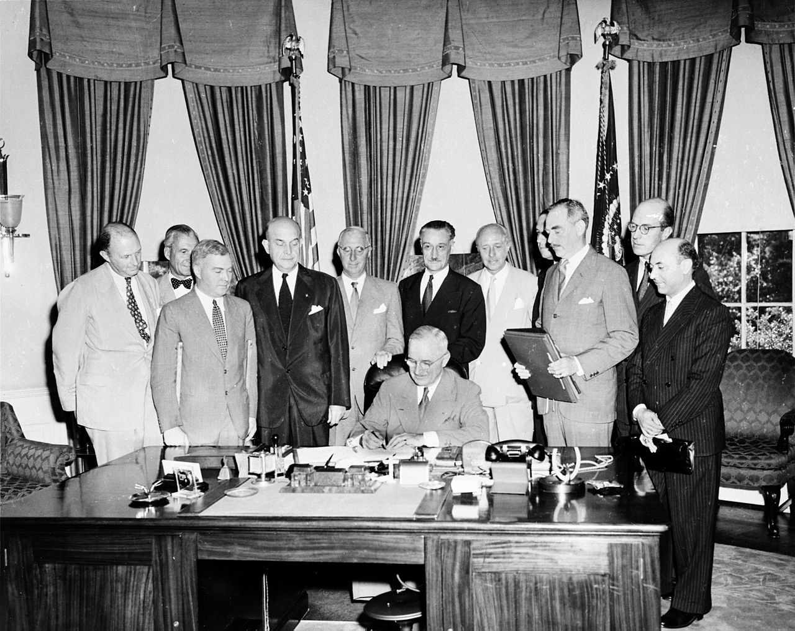

# [fit] Crisis Diplomacy
# Democracy and Alliances
# April 2, 2015

---

# Recap

* Alliance commitment
* Regime type and international cooperation

---

# Central Question

Are democracies more or less likely than autocracies to maintain alliance commitments?

^ Why we care:
* Extended deterrence
* Causes of war
* Bridge theories of deterrence, alliances, and cooperation

---

# Common Argument

Both Gaubatz and Leeds claim:

Alliance commitments are stronger among democracies than among autocracies.

^ Pursues from theoretical and empirical directions

---

# Risk Factors for Breaking Commitments

* Shifting policy preferences
* Low costs

^ Both of these are necessary conditions

^ Want to analyze how they differ across democracies and autocracies

---

# Preference Stability

* Public involvement
* Leadership turnover
* Institutional continuity
* Preference cycling

^ Public involvement:
for — harder to change lots of minds than just one, all else equal
against — is all else equal?

^ Leadership turnover:
against — leaders change all the time in democracies
for — but those changes are regular, and don't tend to be wild swings as in autocracies

^ Institutional continuity:
for — democracies tend to be long-lived (in rich countries)

^ Preference cycling: see next slide

---

# Preference Cycling

^ Also discuss agenda control?

^
Clinton > Bush
Bush > Paul
Paul > Clinton

---

# Costs of Breaking Commitments

* Interdependence
* Legal norms
* Veto players
* Transparency

^ For each, address why a feature of democracy, and then why increases the cost of defection

^ Interdependence:
freedom → relationships across borders → shared stakes

^ Legal norms:
centrality of rule of law to democratic political cultures

---

# Theoretical Conclusion

Democracies are better at commitment because

1. preferences are more stable
2. costs of breaking commitments are greater

---

# Taking It to Data

Which commitments are the most prominent in international politics?

How can we measure the strength of a commitment?

^ Other salient commitments might include following through on international public goods provision (e.g. climate treaties)

^ How strength is measured—in this case, duration

---

# Hypothesis

Alliance commitments between democracies will last longer than those between autocracies.

---

# Gaubatz: Data Collection

* Unit of analysis
    * Pair of states?
    * Treaty?
* DV: Alliance duration
* IV: Regime type
* Controls:
    * Number of members
    * Major power involvement
    * Type of pact

---

# Gaubatz: Results

---

# Gaubatz: Results

---

# Leeds: Data Collection

* Unit of analysis: State in alliance invoked by war
* DV: Decision to join war
* IV: Regime type
* Controls:
    * Major power status
    * Change in power
    * Change in domestic institutions
    * Initiator's side or target's side?

^ Unit of analysis:
* Connection to previous study of alliance types
* But note now looking at individual states, not entire alliance
* States involved at outset don't count

---

# Leeds: Results

---

# Questions

What are the advantages and disadvantages of each research design?

(Does it matter?)

---

# Next Time

* Read Farrell and Rabin, "Cheap Talk" (JSTOR)
* Read Kydd, "Which Side Are You On?" (JSTOR)

---

# Image Sources

* NATO signing: [Wikimedia Commons](http://commons.wikimedia.org/wiki/File:Truman_signing_North_Atlantic_Treaty.jpg)
* Statistical plots and tables: Gaubatz (1996), Leeds (2003)
